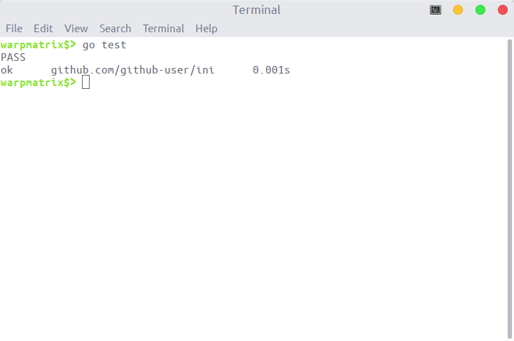
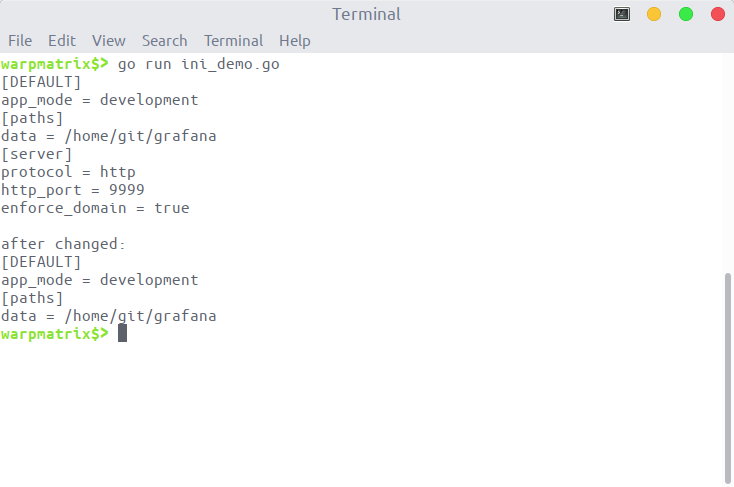

<!-- omit in toc -->
# Specification

<!-- omit in toc -->
## Table of Contents

- [设计说明](#设计说明)
  - [`file.go` 文件](#filego-文件)
  - [`parse.go` 文件](#parsego-文件)
  - [`section.go` 文件](#sectiongo-文件)
- [单元测试结果](#单元测试结果)
- [功能测试结果](#功能测试结果)

## 设计说明

这个包主要包含了以下文件：`file.go`、`parse.go`、`section.go`

### `file.go` 文件

定义主要函数接口 `Load` 和 `Watch`，以及对应的 `Config` 数据结构和对应的方法。

`Load` 函数实现了读取解析 ini 文件的功能，返回对应的 `Config` 数据结构。具体的实现方法为：

1. 使用 `os.Open()` 函数打开对应的 ini 文件
2. 将打开的文件转换为 `bufio.Reader` 类型，方便后续的解析
3. 调用 `parse.go` 文件中定义的 `parse` 函数，解析 ini 文件返回对应的结构体变量指针
4. 将得到的结构体变量指针返回给调用者。

`Watch` 函数实现侦听特定事件发生，随后返回事件发生后，新配置文件对应的 `Config` 结构体变量指针。具体的实现方法是：

1. 接收一个 `listener` 接口，调用其中的 `listen` 函数，侦听事件的发生
2. 若没有指定事件的发生，线程阻塞在 `listen` 函数中，直到发生侦听的事件
3. 发生侦听的事件后，重新调用 `Load` 函数，返回新的 `Config` 结构体变量指针

`Config` 数据结构包含了一个从节名到 `Section` 结构体的映射以及一个存储节名的字符串数组：

```go
// Config represents a INI files in memory
//
// Config 结构将 ini 文件，以特定的形式将文件内容保存在内存中
type Config struct {
    // To keep data in order.
    SecList []string
    // Actual data is stored here.
    Sections map[string]*Section
}
```

### `parse.go` 文件

`parse.go` 文件主要实现了 `parse` 函数，用于对打开的配置文件进行解析转换为对应的 `Config` 结构体变量。ini 配置文件主要需要解析：

- 节名 (section name)
- 注释 (comment)
- 键值对 (key-value)

上面的每一部分都有各自的解析函数，各个解析函数组合构成 `parse` 函数。`parse` 函数每次读取文件的一行，判断该行属于上述的哪一部分调用相应的解析函数，直到读取到文件的结尾。

### `section.go` 文件

`section.go` 文件定义了 `Section` 结构体，用来存储每一节所含有的所有键值对信息以及一个字符串数组存储该节所有的键名。

## 单元测试结果

该包的每一个 `*.go` 都对应一个 `*_test.go` 文件，含有相应的测试函数。执行对应的 `go test` 指令，所有的单元测试都得到了通过，结果如下图所示。



## 功能测试结果

使用如下的 go 代码进行功能测试：

```go
package main

import (
    "fmt"
    "log"

    "github.com/fsnotify/fsnotify"
    // ini "domain-name/Id/repo"
    "github.com/github-user/ini"
)

func main() {
    cfg, err := ini.Load("my.ini")
    if err != nil {
        fmt.Println(err)
        return
    }
    printCfg(cfg)

    var listener ini.ListenFunc = fileChange
    cfg, err = ini.Watch("my.ini", listener)
    if err != nil {
        fmt.Println(err)
        return
    }
    fmt.Println("")
    fmt.Println("after changed:")
    printCfg(cfg)
}

func fileChange(filename string) {
    watcher, err := fsnotify.NewWatcher()
    if err != nil {
        log.Fatal(err)
    }
    defer watcher.Close()
    done := make(chan bool)
    go func() {
        for {
            select {
            case event, ok := <-watcher.Events:
                if !ok {
                    return
                }
                if event.Op&fsnotify.Write == fsnotify.Write {
                    done <- true
                    return
                }
            case err, ok := <-watcher.Errors:
                if !ok {
                    return
                }
                log.Println("error:", err)
            }
        }
    }()
    watcher.Add(filename)
    <-done
}

func printCfg(cfg *ini.Config) {
    for _, secName := range cfg.SecList {
        sec := cfg.Sections[secName]
        fmt.Printf("[%s]\n", secName)
        for _, key := range sec.KeyList {
            fmt.Printf("%s = %s\n", key, sec.KeyVal[key])
        }
    }
}
```

创建 `my.ini` 文件与上述的 go 代码放在同一目录下，填充以下内容：

```ini
# possible values : production, development
app_mode = development

[paths]
# Path to where grafana can store temp files, sessions, and the sqlite3 db (if that is used)
data = /home/git/grafana

[server]
# Protocol (http or https)
protocol = http

# The http port  to use
http_port = 9999

# Redirect to correct domain if host header does not match domain
# Prevents DNS rebinding attacks
enforce_domain = true
```

运行上述 go 程序后，将上面的 `my.ini` 文件修改为以下内容：

```ini
# possible values : production, development
app_mode = development

[paths]
# Path to where grafana can store temp files, sessions, and the sqlite3 db (if that is used)
data = /home/git/grafana

# [server]
# Protocol (http or https)
# protocol = http

# The http port  to use
# http_port = 9999

# Redirect to correct domain if host header does not match domain
# Prevents DNS rebinding attacks
# enforce_domain = true
```

得到的结果如下，符合我们所需要求：


